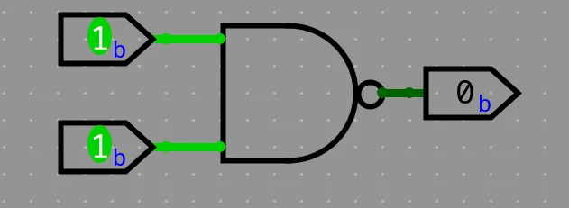

## Introduction

A general-purpose computer is a programmable electronic device that can run many different types of software and perform many different tasks, such as word processing, web browsing, playing games, or watching videos.

In this series of articles, we'll build both the hardware and software of a fully functional general-purpose computer.

We'll start with a simple logic gate called **NAND** (the elementary building block in our computer), It'll serve as a layer of abstraction from the electronics world. We'll use it as an interface that hides the complexity and frees up mental space for what's ahead (We already have enough complexity to deal with).

Abstraction is the key of building a very large complex piece of engineering. And that's what makes us able to make a general-purpose computer starting from nothing but **NAND** gates.

So, what the prerequisites for this series of articles? Just to be a good learner, basic knowledge of electrical engineering and programming concepts is a plus. Understanding just what is **NAND** gate is an enough indication that you can continue.

By the end of this series, you’ll really appreciate how far computers have come.

## Logic gates

Computers operate on electricity (discrete electrical signals), which is abstracted into binary values: 0s and 1s. These correspond to true or false, high or low voltage levels (for example, 5V and 0V).

First we'll know about **NAND** and how to create other logic gates using it like **NOT**, **AND**, **OR**, **NOR**, **XOR**, **XNOR**, then we'll learn about boolean expressions and functions.

You can use [**Logisim-evolution**](https://github.com/logisim-evolution/logisim-evolution?tab=readme-ov-file) for simulation.
### NAND

What's **NAND** gate? as we said before, it's an abstraction, so we don't have to worry about how it works, we only need to know what it is to use it.

Outputs 0 only when all inputs are 1. Here is all inputs and outputs conditions:

| A   | B   | NAND |
| --- | --- | ---- |
| 0   | 0   | 1    |
| 0   | 1   | 1    |
| 1   | 0   | 1    |
| 1   | 1   | 0    |

### NOT

Outputs the reverse (compliment) of the input. How to make this functionality using the **NAND** gate?

| A   | NOT |
| --- | --- |
| 0   | 1   |
| 1   | 0   |

So, the **NOT** gate is abstracted to be like this:

Now, we don't care that the **NOT** gate is implemented using the **NAND** gate, just we'll use it when we need it. This what we'll do for the next gates.
### AND

Outputs only 1 when all inputs are 1.

Now it's the time to use our abstraction, the **NOT** gate and the **NAND** gate to construct the **AND** gate.

| A   | B   | AND |
| --- | --- | --- |
| 0   | 0   | 0   |
| 0   | 1   | 0   |
| 1   | 0   | 0   |
| 1   | 1   | 1   |

### OR

Outputs 1 when at least one input is 1.

How to make the **OR** gate using the **NAND** gate? — Reverse thing, it's output is 0 when all inputs are 0, so you can use **NAND** but invert all its inputs.

| A   | B   | OR  |
| --- | --- | --- |
| 0   | 0   | 0   |
| 0   | 1   | 1   |
| 1   | 0   | 1   |
| 1   | 1   | 1   |

### XOR

Outputs 1 only when its inputs are different, odd number of 1s. How to construct that using the previous gates? Try it yourself before seeing the solution, the [K-Map (Karnaugh Map)](https://www.geeksforgeeks.org/digital-logic/introduction-of-k-map-karnaugh-map/) technique may help you.

| A   | B   | XOR |
| --- | --- | --- |
| 0   | 0   | 0   |
| 0   | 1   | 1   |
| 1   | 0   | 1   |
| 1   | 1   | 0   |

Now, you can forget about what you did to construct the **XOR** gate and just focus on what the use of it.

Other gates like **XNOR** just the **XOR** inverted, same thing for **NOR**.

## Inside the NAND gate (Optional)

This is the implementation of the **NAND** gate using two NPN transistors. Once we abstract it into a **NAND**, we no longer have to think about the transistors underneath.

I hope you now appreciate the beauty of **abstraction** — a trick of the mind that allows us to design larger and larger systems.

## Boolean expressions and functions

This is where we stop thinking in terms of physical gates and start describing logic **mathematically**.

This way allows us to design, simplify, and reason about circuits before we ever touch hardware.

### What is a Boolean Expression?

A **Boolean expression** is a mathematical representation of a logic circuit using variables, constants (0/1) and logical operators.
Each variable can have only two possible values — **1 (True)** or **0 (False)** — just like the outputs of our logic gates.

These expressions use operators such as:

|Operator|Symbol|Equivalent Gate|Description|
|---|---|---|---|
|AND|`·` or no symbol (e.g., AB)|AND|True only if all inputs are True|
|OR|`+`|OR|True if at least one input is True|
|NOT|`¬` or `’` (A’, ¬A)|NOT|Inverts the input|
|XOR|⊕|XOR|True if inputs are different|

So, for example, if you have a simple circuit with two inputs **A** and **B**, and an output that is **1** only when both are **1**, you can represent it as:

`F = A · B`

This means “**F equals A AND B**”.

Another example, let’s say you have a circuit that outputs 1 when either **A** is 1, or **B** is 0.  
The Boolean expression for that is:

`F = A + B’`

Here, **B’** means NOT B — the inverse of **B**.  
So, if B = 0 → B’ = 1.

### Boolean Functions

A **Boolean function** is simply a **relationship between one or more input variables and a single output**, defined using a Boolean expression.

For instance, consider this function:

`F(A, B, C) = A·B + ¬C`

This describes a logic circuit that outputs **1** if **A AND B** are both 1, **or** if **C** is 0.

You can think of a Boolean function as a **recipe** that tells the circuit what to do for every possible combination of inputs.

|A|B|C|F(A,B,C) = A·B + ¬C|
|---|---|---|---|
|0|0|0|1|
|0|0|1|0|
|0|1|0|1|
|0|1|1|0|
|1|0|0|1|
|1|0|1|0|
|1|1|0|1|
|1|1|1|1|

From this **truth table**, you can visualize the function’s behavior across all inputs.

### Canonical Forms (Sum of Products and Product of Sums)

To simplify and standardize Boolean logic, we use two common forms of expression:

#### 1. **Sum of Products (SOP)**

In SOP form, the function is expressed as a sum (OR) of multiple product (AND) terms.  
Example:

`F = A’B + AB’`

Each term (like A’B) corresponds to a row in the truth table where the output is 1.

#### 2. **Product of Sums (POS)**

In POS form, the function is written as a product (AND) of multiple sum (OR) terms.  
Example:

`F = (A + B)(A’ + C)`

Each term corresponds to a row in the truth table where the output is 0.

Both forms describe the same logic but in different structural ways.  
Digital circuit designers often convert between them for optimization or implementation purposes.

### Simplifying Boolean Expressions

Just like simplifying algebraic equations, Boolean algebra allows us to **reduce** complex expressions into simpler ones — which means **fewer gates** and **faster circuits**.

Here are a few essential **Boolean laws**:

| Law          | Expression         | Expression              |
| ------------ | ------------------ | ----------------------- |
| Identity     | A + 0 = A          | A · 1 = A               |
| Null         | A + 1 = 1          | A · 0 = 0               |
| Idempotent   | A + A = A          | A · A = A               |
| Complement   | A + A’ = 1         | A · A’ = 0              |
| Distributive | A(B + C) = AB + AC | A + BC = (A + B)(A + C) |
| De Morgan’s  | ¬(A·B) = ¬A + ¬B   | ¬(A + B) = ¬A·¬B        |

Simplification helps transform expressions like:

`F = A·B + A·B’`

into:
`F = A(B + B’)`
`F = A · 1`
`F = A`

— a huge efficiency gain when building circuits!

### Visualization with Karnaugh Maps (K-Maps)

For functions with more than two or three variables, manual simplification can get messy.  
That’s where **Karnaugh Maps (K-Maps)** come in — a graphical tool that helps you visually minimize Boolean expressions by grouping 1’s in the truth table.

Using K-Maps ensures your final circuit uses the minimum possible number of gates — a critical skill for anyone learning **digital logic design**.
