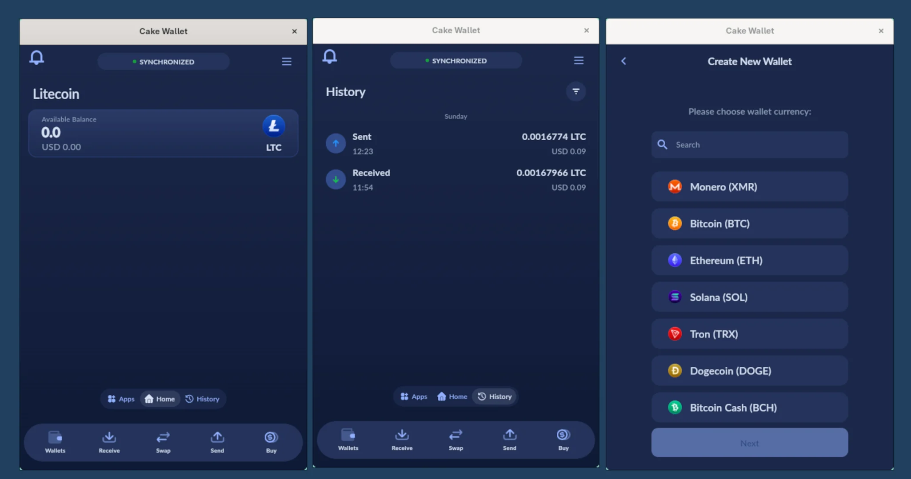
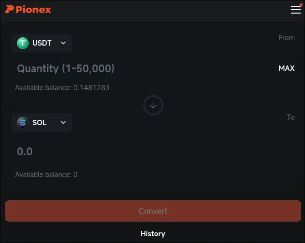

## What Is Cryptocurrency?

Cryptocurrency is a type of digital or virtual money that exists only online. Unlike traditional currencies such as dollars or euros, cryptocurrencies are not issued or controlled by banks or governments. Instead, they use advanced technology to enable secure, peer-to-peer transactions across the internet.

The word _cryptocurrency_ comes from [**cryptography**](/cryptographic-tools-in-computer-security), a method of protecting information using complex codes. This technology ensures that transactions are secure, transparent, and difficult to alter.

---

## How Does Cryptocurrency Work?

Cryptocurrencies operate on a technology called [**blockchain**](/blockchain-explained). A blockchain is a public digital ledger that records every transaction made using a specific cryptocurrency.

Here’s a simple breakdown:

- Transactions are grouped into blocks
    
- Each block is linked to the previous one
    
- Once recorded, data cannot easily be changed
    

This system removes the need for a central authority, such as a bank, and allows users to send money directly to one another.

---

## What Is Blockchain Technology?

Blockchain is the backbone of cryptocurrency. It is a decentralized network maintained by thousands of computers (called nodes) around the world. Because the data is shared across many systems, no single entity has full control, making the network highly secure and transparent.

Key benefits of blockchain include:

- High security
    
- Transparency
    
- Resistance to fraud
    
- No single point of failure
    

---

## Popular Types of Cryptocurrencies

There are thousands of cryptocurrencies available today, but here are a few well-known ones beginners should know:

### Bitcoin (BTC)

Bitcoin was the first cryptocurrency and remains the most popular. It is often called “digital gold” and is used primarily as a store of value.

### Ethereum (ETH)

Ethereum goes beyond digital currency by enabling **smart contracts**, which are self-executing agreements built into the blockchain.

### Stablecoins

Stablecoins are cryptocurrencies designed to maintain a stable value by being tied to traditional currencies like the US dollar. Examples include **USDT** and **USDC**.

---

## How Do You Use Cryptocurrency?

People use cryptocurrency for various purposes, including:

- Online payments
    
- Investment and trading
    
- Sending money internationally
    
- Accessing decentralized applications (dApps)
    

To use cryptocurrency, you need a **crypto wallet**, which stores your digital assets and allows you to send or receive funds.

---

## Is Cryptocurrency Safe?

Cryptocurrency itself is secure due to blockchain technology, but users must take responsibility for protecting their wallets and private keys. Risks include hacking, scams, and market volatility.

Basic safety tips:

- Use reputable wallets and exchanges
    
- Never share your private keys
    
- Enable two-factor authentication
    
- Be cautious of scams
    

---

## Advantages and Disadvantages of Cryptocurrency

### Advantages

- Fast and low-cost transactions
    
- No middlemen like banks
    
- Global accessibility
    
- Transparent and secure
    

### Disadvantages

- Price volatility
    
- Limited acceptance in some regions
    
- Regulatory uncertainty
    
- Requires technical understanding
    

---

## Should Beginners Invest in Cryptocurrency?

Cryptocurrency can be an exciting opportunity, but beginners should approach it carefully. Start by learning the basics, investing small amounts, and using trusted platforms. Never invest more than you can afford to lose.

---

## How to Get Cryptocurrency?

First, to own such assets like cryptocurrency you need a wallet. You can use your own wallet having your own private keys such as [Cake Wallet](https://cakewallet.com/) , which is a free and open-source wallet. The wallet private keys are generated by a seed (12 or 24 words) that you should keep them safe and store them securely. You can use the same seed in any wallet program and losing them meaning losing your money. You can also use hardware wallets like [Ledger](https://www.ledger.com/).

### [Crypto Mining](/cryptocurrency-mining-on-any-device)

**Crypto mining** is the process of validating transactions on a blockchain network and earning cryptocurrency as a reward. It is the backbone of many cryptocurrencies, including Bitcoin and Ethereum, ensuring security and decentralization.

#### How Crypto Mining Works

1. **Transaction Verification**  
    Miners bundle transactions into blocks and verify them using complex mathematical problems.
    
2. **Proof of Work**  
    The blockchain requires miners to solve cryptographic puzzles (Proof of Work) to confirm a block.
    
3. **Rewards**  
    Once a block is validated, miners receive cryptocurrency as a reward. This reward is how new coins enter circulation.
    

Mining can be done with:

- **Specialized hardware** (ASIC miners) for e.g. BTC and LTC
    
- **Graphic cards (GPU mining)**
    
- **CPU mining** for example, Randomx algorithm for e.g. XMR (Monero) mining
    
- **Cloud or software-based mining services**

### Centralized Crypto-Exchanges (CEX)

A **Centralized Exchange (CEX)** is the easiest and most common way for beginners to buy cryptocurrency.

Using a CEX, you can:

- Buy crypto with a **credit/debit card**
    
- Use **bank transfers**
    
- Trade via **peer-to-peer (P2P)** marketplaces
    

A common beginner approach is to buy a **stablecoin** such as **USDT** or **USDC**, then swap it for other cryptocurrencies like **Bitcoin (BTC)**, **Ethereum (ETH)**, or **Solana (SOL)** when prices are favorable.

CEX platforms also provide:

- High liquidity
    
- Simple user interfaces
    
- Customer support
    
- Built-in wallets and trading tools
    

#### Is CEX Safe?

Using a centralized exchange is convenient, but it comes with risks you should understand.

**Key risks of keeping crypto on a CEX:**

- You do **not control the private keys**, meaning you don’t fully own your assets
    
- Exchanges are frequent targets of **cyberattacks**
    
- Smaller or poorly managed exchanges may shut down unexpectedly
    
- Accounts can be frozen due to regulations or technical issues
    

That’s why the common best practice is:

> **Buy crypto on a CEX, then withdraw it to your own wallet.**

You can use my personal favorite CEX, [Pionex](/automated-crypto-trading-with-pionex)

This way, you keep full control over your funds while still benefiting from the convenience of exchanges.

### Decentralized Exchanges (DEX)

Another way to get cryptocurrency is through **Decentralized Exchanges (DEXs)**.

DEX platforms allow you to trade crypto **directly from your wallet**, without intermediaries. You remain in full control of your assets at all times.

DEXs are best for users who:

- Value privacy and self-custody
    
- Already own some cryptocurrency
    
- Are comfortable using blockchain wallets
    

However, DEXs usually do not support direct fiat purchases, so beginners often start with a CEX and later move to DEX platforms.

---

## Best Practice for Beginners

1. Buy crypto using a **trusted CEX**, I suggest [Pionex](https://accounts.pionex.com/en/signUp?r=0HknVpaMZhb)
    
2. Withdraw funds to a **non-custodial wallet**
    
3. Secure your seed phrase properly
    
4. Learn before trading or investing large amounts

## Final Thoughts

Cryptocurrency is transforming how people think about money and finance. While it may seem complex at first, understanding the basics can help you make informed decisions. As blockchain technology continues to evolve, cryptocurrency is likely to play an increasingly important role in the global economy.

If you’re just starting out, take your time, stay informed, and focus on learning before investing.
