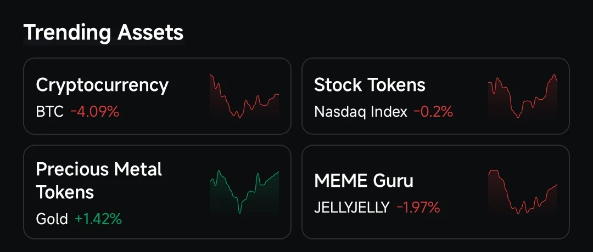
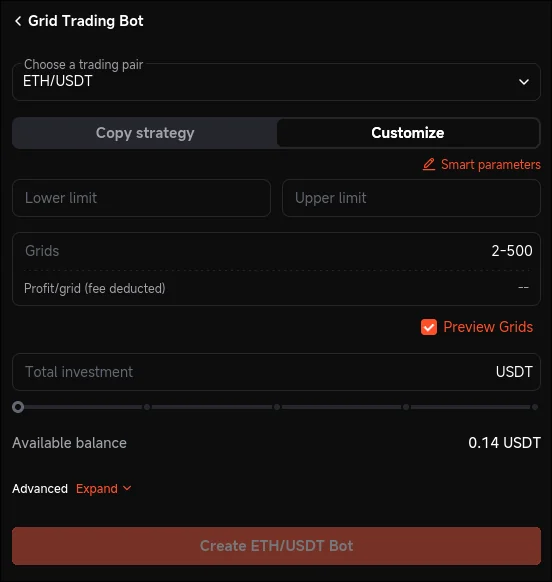
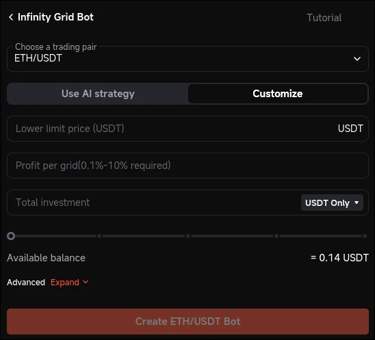
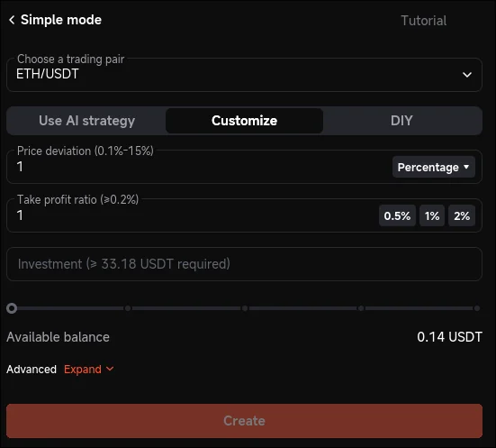
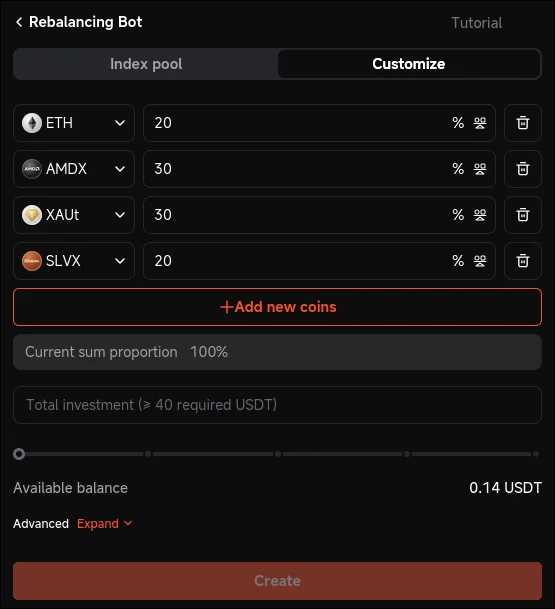
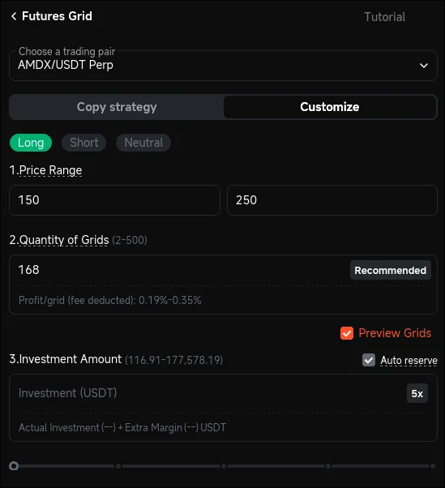
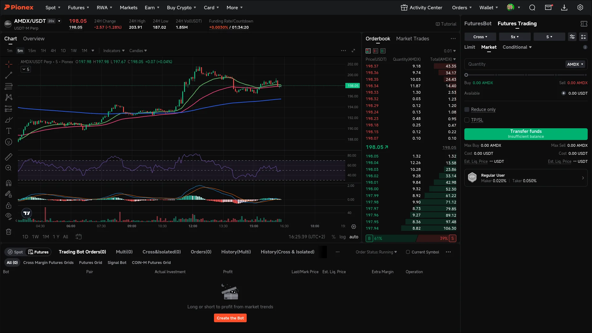
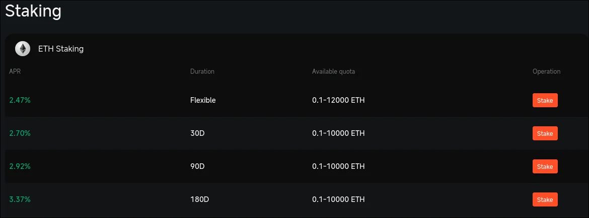
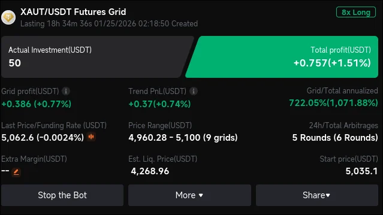

**Pionex** is a **centralized cryptocurrency exchange** that focuses heavily on **automated trading bots**. Unlike most exchanges where you need third-party tools or APIs to run bots, Pionex offers built-in trading bots directly on its platform.

One of Pionex’s biggest advantages is its **clean and easy-to-use interface**, making it ideal for beginners who want to explore algorithmic trading without technical complexity.

## Trading Assets Available on Pionex

Pionex supports multiple asset categories, allowing users to diversify their trading strategies across different markets.

### 1. Cryptocurrency Trading

Pionex offers popular cryptocurrencies such as:

- **Bitcoin (BTC)**
    
- **Ethereum (ETH)**
    
- **Solana (SOL)**
    
- Many other altcoins and trading pairs
    

These assets are commonly used with grid bots, DCA bots, and rebalancing strategies.

### 2. Stock Tokens

One unique feature of Pionex is its support for **tokenized stocks**, which allow users to gain exposure to traditional equity markets using crypto.

Examples include:

- **AMDX** (AMD)
    
- **NVDAX** (NVIDIA)
    
- **TSLAX** (Tesla)
    
- **AMZNX** (Amazon)
    

These tokens track the price of real-world stocks and can be traded just like cryptocurrencies on the platform.

### 3. Precious Metal Tokens

Pionex also supports **tokenized precious metals**, which is uncommon among crypto exchanges.

Available assets include:

- **XAUT** – Tokenized Gold
    
- **SLVX** – Tokenized Silver
    
- **XPD** – Palladium
    
- **XPT** – Platinum
    

These assets are useful for traders looking to hedge volatility or diversify into commodities while staying within the crypto ecosystem.

---

## Low Trading Fees on Pionex

One major advantage of Pionex is its **low trading fees**, which are especially important for bot trading where frequent transactions occur.

- **Spot trading fees:** Competitive and beginner-friendly
    
- **Futures trading fees:** Lower than many traditional exchanges
    

Lower fees mean more of your profits stay in your account, which is crucial for long-term automated strategies.

---

## Advantages of Using Pionex for Bot Trading

Here are some of the main benefits of Pionex bot trading:

- Built-in bots with no extra cost
    
- Supports crypto, stock tokens, and precious metals
    
- Beginner-friendly interface
    
- Low trading fees
    
- Automation reduces emotional trading
    

These features make Pionex a strong option for users exploring automated trading for the first time.

---

## How Pionex Trading Bots Work

Pionex bots operate using predefined rules:

1. You choose a trading pair (for example, BTC/USDT)
    
2. Select a bot type
    
3. Set parameters like price range and investment amount
    
4. Activate the bot
    
5. The bot automatically buys low and sells high based on market movements
    

Once running, the bot continues trading without emotional decisions, helping users maintain discipline.

---

## What Is Pionex Bot Trading?

**Pionex bot trading** refers to using automated bots provided by the exchange to execute trades based on predefined strategies.

Instead of manually buying and selling, bots handle everything automatically—24/7.

Some popular Pionex bots include:

### 1. Grid Trading Bot (Spot Grid)

#### Strategy Logic

The **Spot Grid Bot** is based on a classic grid trading strategy. It places multiple buy and sell orders at fixed price intervals within a defined range.

- Buy orders are placed below the current price
    
- Sell orders are placed above the current price
    
- Every completed buy–sell cycle locks in small profits
    

The bot profits from **price oscillations**, not market direction.

#### Best Market Conditions

- Sideways or ranging markets
    
- Moderate volatility
    
- Assets with frequent price fluctuations
    

#### Advanced Notes

- Smaller grid spacing increases trade frequency but raises fee impact
    
- Wider grids reduce trades but increase profit per trade
    
- Capital efficiency depends heavily on grid count and range accuracy
    

#### Risks

- Prolonged strong trends can leave capital stuck on one side
    
- Poorly chosen price ranges reduce effectiveness
    

---

### 2. Infinity Grid Bot

#### Strategy Logic

The **Infinity Grid Bot** is an advanced version of the grid strategy without an upper price limit.

- The bot continuously places sell orders above market price
    
- As price rises, new grid levels are automatically extended upward
    
- Ideal for capturing long-term upward trends
    

Unlike the regular grid bot, it never stops selling as price makes new highs.

#### Best Market Conditions

- Long-term bullish markets
    
- Strong trending assets (e.g., BTC, ETH during uptrends)
    

#### Advanced Notes

- No fixed top price prevents missed upside
    
- Requires patience and strong asset conviction
    
- Works best with high-liquidity assets
    

#### Risks

- Pullbacks can reduce unrealized profits
    
- Not suitable for prolonged downtrends

### 3. Dollar Cost Averaging (DCA) Bot

#### Strategy Logic

The **DCA Bot** accumulates assets by placing buy orders at predefined price drops.

- Initial entry at market price
    
- Additional buys triggered as price falls
    
- Average entry price decreases over time
    

Once price rebounds, the bot sells at a predefined take-profit level.

#### Best Market Conditions

- Volatile markets with frequent pullbacks
    
- Accumulation phases
    

#### Advanced Notes

- Safety order spacing controls drawdown risk
    
- Larger safety order volume increases recovery speed
    
- Often used for long-term accumulation strategies
    

#### Risks

- Strong, extended downtrends can exhaust capital
    
- Requires sufficient reserve funds

### 4. Rebalancing Bot

#### Strategy Logic

The **Rebalancing Bot** maintains a fixed asset allocation ratio across multiple assets.

Example:

- XAUT 30%    
- AMDX 30%    
- ETH 20%
- SLVX 20%

When one asset outperforms others, the bot sells the outperformer and buys underperformers, maintaining balance.

#### Best Market Conditions

- Volatile multi-asset portfolios
    
- Long-term holding strategies
    

#### Advanced Notes

- Profits from volatility rather than direction
    
- Automatically enforces “buy low, sell high”
    
- Works best with uncorrelated assets
    

#### Risks

- Underperforms in strong single-asset trends
    
- Requires long-term horizon to show results

### 5. Futures Grid Bot

#### Strategy Logic

The **Futures Grid Bot** applies grid trading to **perpetual futures contracts** with leverage.

- Uses borrowed capital to amplify gains
    
- Can be configured for long or short strategies
    
- Grid orders are placed around an entry price
    

#### Best Market Conditions

- High-liquidity futures markets
    
- Sideways or moderately trending conditions
    

#### Advanced Notes

- Leverage multiplies both profit and risk
    
- Funding rates affect long-term profitability
    
- Margin management is critical
    

#### Risks

- Liquidation risk if price moves aggressively
    
- Not recommended for beginners

## Pionex manual trading

**Pionex** focused about bot trading but also supports manual trading for spot and futures also.

## Staking ETH and SOL on Pionex

Crypto staking is the process of locking up tokens to support a blockchain network that uses a **Proof-of-Stake (PoS)** consensus mechanism. In return for helping secure the network and validate transactions, stakers earn rewards.

Pionex allows users to earn **passive income** by staking assets like **SOL** and **ETH** directly on the platform. Staking lets you earn rewards simply by holding your coins, without running nodes or managing any technical setup.

## Pionex Card — Spend Crypto in the Real World

The [**Pionex Card**](https://support.pionex.com/hc/en-us/articles/47904844675737-Digital-Wallet-Setup-Instructions?utm_source=chatgpt.com) is a crypto debit card that allows users to spend their digital assets in everyday life. Instead of keeping crypto only for trading, the card makes it possible to use funds for online shopping and real-world payments, just like a traditional debit card.

Users can transfer supported balances (such as stablecoins) from their Pionex account to the card and pay at merchants that accept card payments. The card can also be connected to popular digital wallets, making contactless and online payments more convenient.

The Pionex Card is designed to bridge the gap between **crypto trading and daily spending**, offering a practical way to use crypto without manual conversions or complicated steps.

## Personal experience and registration for Pionex

The registration process only takes a few minutes:

1. Open my affiliate link
    
2. Create an account using email or mobile number
    
3. Complete basic verification
    
4. Deposit funds and start trading or using bots

This is some of my personal trading experience with Pionex:

By registering through my [affiliate link](https://accounts.pionex.com/en/signUp?r=0HknVpaMZhb), to get bonus **50 USDT** on futures grid bot and also support this website at no extra cost to you, while gaining full access to Pionex features such as bot trading, staking, and the Pionex Card.