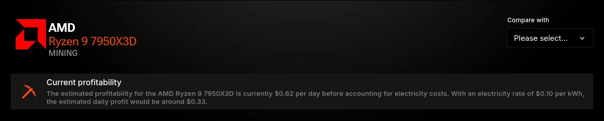
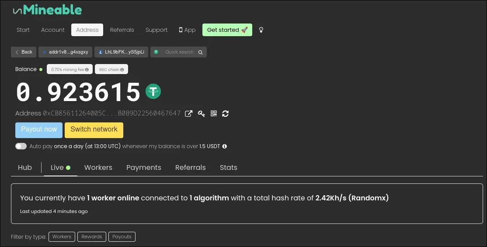
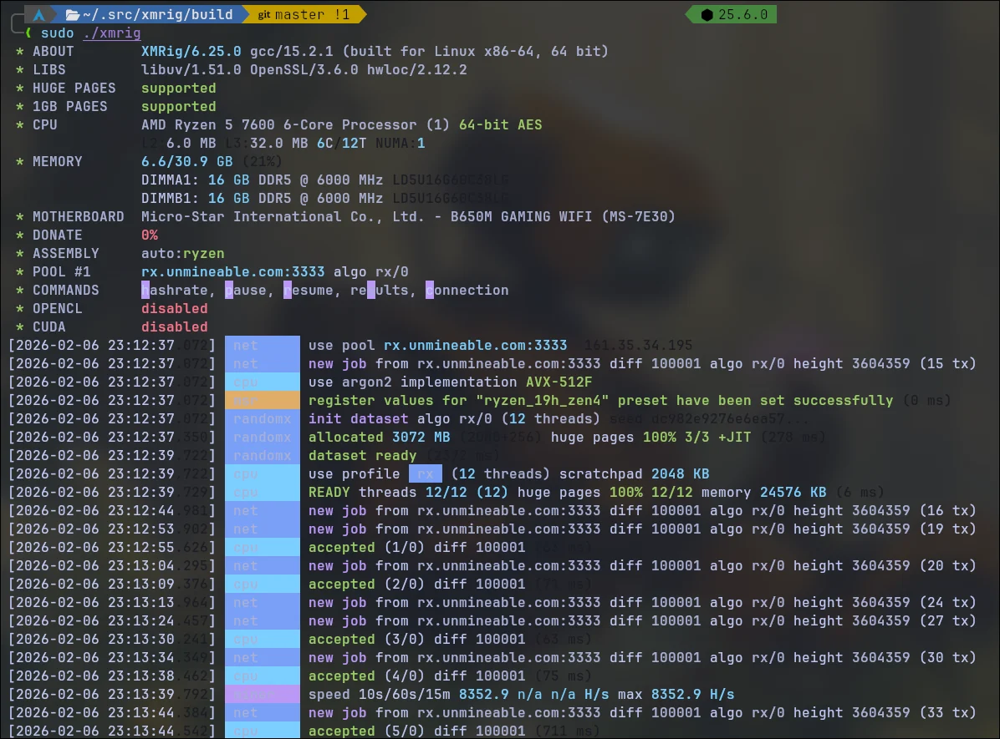
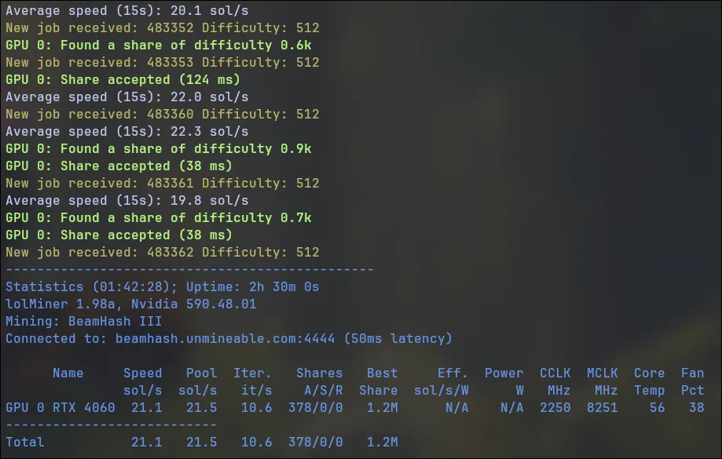

This guide breaks everything down in plain language and shows you how to get started using popular tools like **XMRig**, **lolMiner**, mining scripts, and platforms like **unMineable**.

---

## What Does “Mining on Any Device” Really Mean?

Mining is the process of using your device’s computing power to secure a blockchain network and earn crypto rewards. Different devices excel at different tasks:

- **CPU mining** – Works on almost any computer
    
- **GPU mining** – Best balance of power and efficiency
    
- **ASIC mining** – Very powerful but expensive and limited
    
- **Low-power devices** – Can mine indirectly via pools
    

The key is choosing the **right algorithm and coin** for your hardware.

---

## Hashrate: The #1 Factor in Mining Profitability

Your **hashrate** measures how fast your device can solve cryptographic calculations.

- Higher hashrate = more chances to earn rewards
    
- Lower hashrate = still viable with the right coin/pool
    

Hashrate is usually measured in:

- **H/s** (Hashes per second)
    
- **KH/s, MH/s, GH/s** for more powerful hardware
    

Before mining, always check:

1. Your device’s hashrate
    
2. Which algorithm it performs best on
    
3. Which coin uses that algorithm





This step tells you **whether mining is profitable or not**. I suggest checking [Hashrate](https://www.hashrate.no/) to know every mining hardware:

- Hashrate
- Revenue
- Profit
- Mining algorithms or coins
- Mining pools for each coin
- Exchange or markets for each coin
- Places to buy it


## unMineable

**unMineable** is a beginner-friendly mining pool that lets you **mine almost any cryptocurrency**, even if your hardware doesn’t natively support its algorithm. It’s especially useful for casual miners who want to earn popular coins like **Bitcoin, Ethereum, or Dogecoin** without buying specialized hardware.

Unlike traditional pools that require your GPU or CPU to support a coin’s native algorithm, unMineable **automatically converts your mining rewards** into the coin of your choice.



### How unMineable Works

1. **Choose a coin:** You pick the cryptocurrency you want to earn (e.g., BTC, ETH, DOGE).
    
2. **Mine with supported algorithms:** Your hardware mines using a compatible algorithm such as **RandomX, Ethash, KawPow, or Autolykos**.
    
3. **Automatic conversion:** unMineable converts the mined coin into the cryptocurrency you selected and sends it to your wallet.
    
4. **Low fees and easy setup:** Mining fees are minimal, and there’s no need to manage multiple wallets for different coins.
    

This means you can **mine Bitcoin with a GPU or CPU**, even though Bitcoin normally requires ASIC miners.

---

When it comes to mining cryptocurrency on almost any device, the first step is choosing the **right mining software**. Two of the most popular and versatile options are **XMRig** and **lolMiner**.

## XMRig

**XMRig** is one of the most popular open-source miners for CPU and GPU mining, especially for **RandomX-based coins like Monero (XMR)**. It supports both **Windows and Linux**, offers high performance, and works well with mining pools such as **unMineable**.

Understanding how to properly set up XMRig on your operating system helps you maximize **hashrate** and determine whether your hardware is profitable.

### XMRig on Windows

#### 1. Download XMRig

- Visit the official [XMRig GitHub repository](https://github.com/xmrig/xmrig)
    
- Download the **Windows precompiled binary** from **Releases**
    
- Extract the ZIP file
    

⚠️ **Note:** Windows Defender may flag XMRig as malware because it uses CPU resources. You may need to add an exclusion.

#### 2. Configure XMRig (config.json or command line)

You can either edit `config.json` or run XMRig via command line.

Example: Mining via [**unMineable**](https://unmineable.com/)

```
xmrig.exe -o rx.unmineable.com:3333 -u COIN:YOUR_WALLET_ADDRESS.YOUR_WORKER#REFCODE -p x
```

>[!TIP] You can use my referral code: **bdjn-wjls** to decrease your mining fee by 25% with unMineable!

Replace:

- `COIN` → the coin you want to get paid in    
- `YOUR_WALLET_ADDRESS` of your selected coin
- `YOUR_WORKER` → name you hardware e.g. Ryzen5950x
- `REFCODE` → my unMineable referral code **bdjn-wjls**

#### 3. Optimize Hashrate on Windows

- Enable **Huge Pages** (run as Administrator)
    
- Close background apps
    
- Use latest CPU chipset drivers
    
- Monitor hashrate in the terminal
    

Typical CPU hashrates:

- Low-end laptop: 300–800 H/s
    
- Desktop Ryzen CPU: 3,000–10,000+ H/s
    

---

### XMRig on Linux

Linux often provides **better stability and slightly higher hashrates** compared to Windows.



#### 1. Install Dependencies

```shell
sudo apt update sudo apt install -y git build-essential cmake libuv1-dev libssl-dev libhwloc-dev
```

#### 2. Download and Build XMRig

```shell
git clone https://github.com/xmrig/xmrig.git
cd xmrig
mkdir build && cd build 
cmake .. 
make -j$(nproc)
```

The compiled binary will be located in: `xmrig/build/xmrig`

#### 3. Run XMRig on Linux

Example: Mining Monero with [**unMineable**](https://unmineable.com/)

```shell
./xmrig -o rx.unmineable.com:3333 -u COIN:YOUR_WALLET_ADDRESS.WORKER#REFCODE -p x
```

>[!TIP] You can use my referral code: **bdjn-wjls** to decrease your mining fee by 25% with unMineable!

#### 4. Enable Huge Pages

```shell
sudo sysctl -w vm.nr_hugepages=1280
```

Or you can make it permanent:

```shell
sudo bash -c "echo vm.nr_hugepages=1280 >> /etc/sysctl.conf"
```

This can significantly increase your **RandomX hashrate**.

---

### Make XMRig donation 0%

The default release binary for XMRig includes a **1% developer donation**. To make it **0%**, you must **compile XMRig from source** and explicitly disable the donation level from source code.

##### Steps (Linux example)

1. Clone the official XMRig repository:
    

```shell
git clone https://github.com/xmrig/xmrig.git cd xmrig
```

2. Configure XMRig with donation disabled, edit `src/donate.h`:
    

```shell
constexpr const int kDefaultDonateLevel = 0;
constexpr const int kMinimumDonateLevel = 0;
```

3. build XMRig:
    

```shell
mkdir build && cd build
```

4. Compile XMRig:
    

```shell
make -j$(nproc)
```

After compilation, the resulting binary will run with **0% donation**.

---

## lolMiner

**lolMiner** is a widely used GPU miner for both AMD and NVIDIA cards. It supports multiple algorithms such as **Ethash, KawPow, Autolykos, and ZelHash**, making it versatile for mining Ethereum Classic, Ravencoin, Ergo, and more. Unlike XMRig (CPU-focused), lolMiner is **GPU-optimized**, allowing you to maximize hashrate while keeping power efficiency in check.



### lolMiner on Windows
#### 1. Download lolMiner

- Visit the [official lolMiner GitHub releases page](https://github.com/Lolliedieb/lolMiner-releases)
    
- Download the **Windows ZIP** and extract it to a preferred folder.
    

> ⚠️ Note: Some antivirus software may flag mining tools. Add an exception if needed.

#### 2. Configure lolMiner for unMineable

You can mine almost any coin using [**unMineable**](https://unmineable.com/).

```powershell
lolMiner.exe --algo ETHASH --pool eth.unmineable.com:3333 --user COIN:YOUR_WALLET_ADDRESS.WORKER#REFCODE
```

>[!TIP] You can use my referral code: **bdjn-wjls** to decrease your mining fee by 25% with unMineable!

This single setup works for **CPU-friendly coins that normally aren’t mineable on your GPU**.

---

### lolMiner on Linux (AUR Install)

Linux users can install lolMiner easily using **Arch Linux AUR** instead of building from source.

```shell
yay -S lolminer
```

This automatically downloads and installs the latest precompiled lolMiner binary.

#### 1. Run lolMiner

```shell
lolMiner --algo ETHASH --pool eth.unmineable.com:3333 --user COIN:YOUR_WALLET_ADDRESS.WORKER#REFCODE
```

>[!TIP] You can use my referral code: **bdjn-wjls** to decrease your mining fee by 25% with unMineable! 

For this moment, the most profitable mining algorithm for my RTX4060 is BEAM-III. You should find out that from [Hashrate](https://www.hashrate.no/)

This runs the miner with your GPU, mining your chosen coin via unMineable.